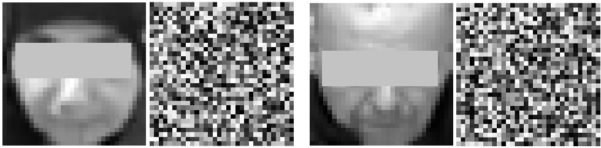

## Private Facial Diagnosis as an AIoT Service over Parkinson's DBS Treatment
### Deep Brain Stimulation for PD's Treatment
Deep brain stimulation (DBS) is a neurosurgical procedure involving the placement of a medical device called a neurostimulator (sometimes referred to as a "brain pacemaker"), which sends electrical impulses, through implanted electrodes, to specific targets in the brain (brain nuclei) for the treatment of movement disorders, including Parkinson's disease, essential tremor, and dystonia. While its underlying principles and mechanisms are not fully understood, DBS directly changes brain activity in a controlled manner.

Fig.1 Facial images of a patient before and after DBS treatment

### AIoT-oriented Facial Diagnosis
A face photo of the patient can be taken via an Artificial-Intelligence-of-Things (AIoT) device such as a mobile phone, and send the photo to the server from home or a hospital. Patients or hospitals, due to privacy concern, may not allow private facial images to be uploaded to the server located in an external business. A privacy-aware framework will then be demanded for the purpose of commercialized medical services to offer a widely acces-sible platform for smart homecare or point-of-care AIoT end users.

Fig.2 Facial Diagnosis over 5G AIoT Edge Service

### Private Facial Diagnosis
Via Partial Homomorphic Encryption (PHE), we can encrypt faical images as shown in Fig.3

Fig.3 Facial Diagnosis over 5G AIoT Edge Service

Fig.4 AIoT-oriented Private Facial Diagnosis Framework

### Evaluation on DBS via Facial Diagnosis
TBA
